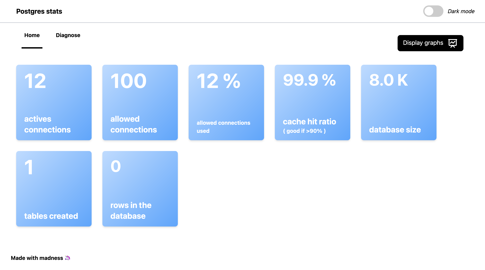
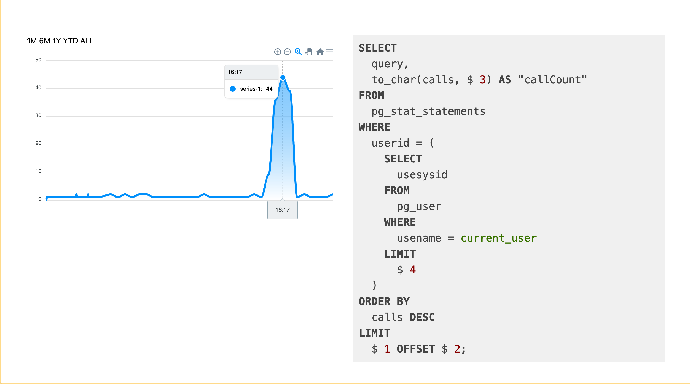

# postgres-stats

*Postgres stats is a dashboard to analyze your Postgres database and speed up you app*


## Motivation 🚀

Heroku provides an [expensive query dashboard](https://blog.heroku.com/expensive-query-speed-up-app) to analyse your expansive queries and speed up your app. I found this tool very useful and I decide to re-create it by myself.

This project helps me to understand more deeper the Postgres project which is my favorite database project. Moreover, I use [Nest.js](https://nestjs.com/) for the backend and continue to appropriate me this framework.

## Requirements 🧑‍🔬

You need to activate stat statements on your Postgres database to use this project. The following command shows you the flag to provide.

```bash
docker run -d \
  -v postgres-stats:/var/lib/postgresql/data \
  -e POSTGRES_PASSWORD=postgres \
  -p 12000:5432 \
  postgres:12 \
  -c shared_preload_libraries='pg_stat_statements' \
  -c pg_stat_statements.max=10000 \
  -c pg_stat_statements.track=all
```

Once you database is ready, create the extension if it is not already done.

```bash
CREATE EXTENSION pg_stat_statements;
```

## Screenshots  🖼





## Requests

- Max connections: pg:user-connections
- Indexes: pg:cache-hit && pg:index-usage

## Sources

- https://github.com/heroku/heroku-pg-extras
- https://gist.github.com/anvk/475c22cbca1edc5ce94546c871460fdd

#### Built with

* [Node.js (v15)](https://nodejs.org/en/) - Javascript runtime
* [Nuxt.js (v2.14)](https://nuxtjs.org/) - Vue.js framework
* [Tailwindcss (v2)](https://tailwindcss.com/) - Utility-first CSS framework
* [Nest.js (v7)](https://nestjs.com/) - A progressive Node.js framework
* [Postgres (v12)](https://nestjs.com/) - Relationnal database
* [MongoDB (v4.4.2)](https://www.mongodb.com/) - NoSQL database 
